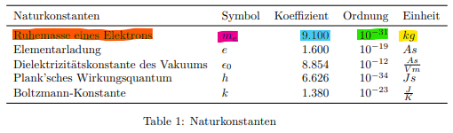
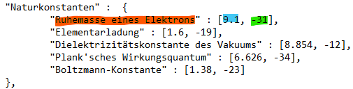
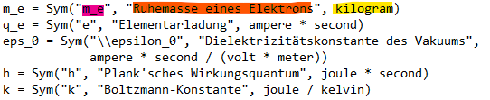
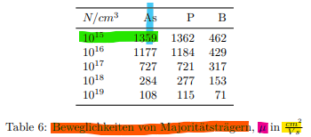
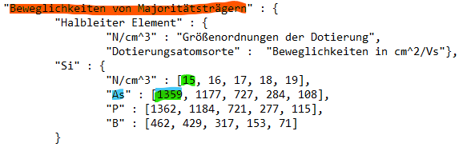
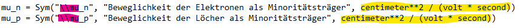

parameters.json
===============

Guide on how to adjust simulation parameters

Color coded example #1
----------------------

For universal constants and material parameters set values in json and unit in *symbols.py* as follows:

  Screenshot from *Initial Parameters.pdf*

  Screenshot from *parameters.json*

  Screenshot from *symbols.py*

Color coded example #2
----------------------

For electrical mobility set values in json and unit in *symbols.py* as follows:

  Screenshot from *Initial Parameters.pdf*

  Screenshot from *parameters.json*

  Screenshot from *symbols.py*